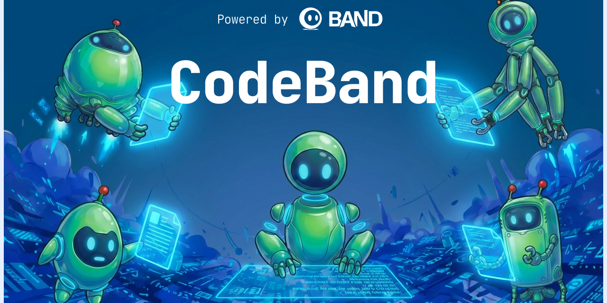

# Codeband

<p align="center">
  
</p>

[](https://www.python.org/downloads/)
[](LICENSE)
[](https://pypi.org/project/codeband/)
[](https://github.com/thenvoi/codeband)

**Adversarial multi-model coding agents via [Band.ai](https://band.ai).**

Codeband runs Claude Code and Codex in adversarial roles on the same repository: one model family writes code, the other reviews it before merge. The same pattern applies to planning: one model decomposes the task, the other validates the plan. The goal is to catch blind spots that same-model review can miss, while keeping every worker isolated in its own git worktree.

It is built for headless operation: local terminals, Linux servers, CI, Docker, and distributed cloud workers.

## Why Codeband?

- **Cross-model review by default**: Claude-written PRs are routed to Codex reviewers, and Codex-written PRs are routed to Claude reviewers.
- **A real orchestration loop**: planner, plan reviewer, coders, code reviewers, mergemaster, and watchdog coordinate through Band.ai.
- **Safe workspace isolation**: each coder works in a separate git worktree and opens a PR.
- **Risk-aware merging**: low-risk PRs can auto-merge; medium, high, and critical changes wait for approval.
- **Human-friendly and headless**: use the interactive shell locally, or run the same orchestrator in CI and Docker.

## What You Need

Codeband needs these in every deployment mode:

1. **Python 3.11+**
   The package installs the `cb` and `codeband` commands.

2. **Band.ai account**
   Used for agent communication and orchestration.

3. **Claude authentication**
   Required for Claude agents. You can use either an Anthropic API key or Claude Code subscription login. Codeband shells out to the `claude` CLI.

4. **Codex/OpenAI authentication**
   Required if you use Codex agents. The default config does, so set `OPENAI_API_KEY` or log in with Codex locally. Codeband shells out to the `codex` CLI.

5. **Git tooling**
   Codeband uses `git` for worktrees, branches, pushes, and fetches. Install `gh` if you want PR and issue workflows.

```bash
cb doctor
```

Run `cb doctor` after setup. It checks credentials, installed tools, config files, Band.ai connectivity, and the memory backend.

## Choose a Run Mode

Start with **local mode** unless you already know you need container isolation or multiple machines.

### Local: easiest first run

Use this when you are trying Codeband, developing locally, or running small jobs on one machine.

```bash
cb          # interactive shell
cb run      # same orchestrator, no UI
```

All agents run in one Python process. They still get isolated git worktrees, but they share your local environment and credentials.

### Docker: same machine, stronger isolation

Use this when you want each agent in its own container, or when running on a server or CI machine.

```bash
cb up
cb up --detach
```

Docker mode still runs on one host. Containers share Docker volumes for the workspace. Put API keys or long-lived tokens in `.env`; containers cannot read the host macOS Keychain.

### Distributed: multiple machines

Use this when you want agents on separate VMs, cloud providers, or hosts.

```bash
cb run --agent conductor
cb run --agent coder-claude_sdk-0
cb run --agent reviewer-codex-0
cb --attach
```

Each agent has its own clone of the repository. Agents coordinate through Band.ai WebSocket and memory, and code moves through the Git remote with `push` and `fetch`.

Distributed mode requires paid Band.ai memory. On free-tier Band.ai, use local or Docker mode on one machine.

## Quick Start

```bash
pip install codeband
cd my-project
cb init --repo https://github.com/myorg/myrepo.git
cp .env.example .env
```

Edit `.env`:

```dotenv
BAND_API_KEY=band_u_...
ANTHROPIC_API_KEY=sk-ant-...
OPENAI_API_KEY=sk-...
```

Then register agents, verify setup, and start the shell:

```bash
cb setup-agents
cb doctor
cb
```

Inside the shell:

```text
> /task Add JWT authentication with tests
> /status
> /diff coder-claude_sdk-0
> /pending
> /approve 42
```

Slash commands take the rest of the line as their argument, so `/task Add JWT authentication with tests` does not need quotes. In a normal terminal command, quote multi-word descriptions: `cb task "Add JWT authentication with tests"`.

On free-tier Band.ai, `cb setup-agents` may not be available. Create the eight default agents manually and write `agent_config.yaml`; the exact keys are documented in [Configuration](docs/CONFIGURATION.md).

For credential precedence, Docker auth, and subscription-vs-API-key behavior, see [Authentication](docs/AUTHENTICATION.md).

## Everyday Commands

```bash
cb                              # interactive shell
cb run                          # headless local orchestrator
cb up --detach                  # Docker stack

cb task "Fix flaky login tests"  # send work to the Conductor
cb prs --sort smallest          # browse open PRs
cb issues --label bug           # browse open issues
cb issue 42                     # send a specific issue

cb feed --no-thoughts           # live activity stream
cb status                       # current task pipeline
cb diff coder-claude_sdk-0      # inspect a worker's changes
cb pending                      # PRs awaiting approval
cb approve 42                   # approve and merge
cb usage                        # token usage and cost summary
```

Inside the shell, use slash commands: `/task`, `/prs`, `/issues`, `/issue`, `/status`, `/diff`, `/pending`, `/approve`, `/reject`, `/log`, `/usage`, `/scale`, `/doctor`, `/help`, and `/quit`.

## Architecture

Default local topology:

```text
User task
   |
   v
Conductor
   |
   +--> Claude Planner ----> Codex Plan Reviewer
   |
   +--> Claude Coder  -----> Codex Code Reviewer ----+
   |                                                  |
   +--> Codex Coder   -----> Claude Code Reviewer ---+--> Mergemaster
   |
   +--> Watchdog
```

The default config uses eight Band.ai agents: Conductor, Mergemaster, one Planner, one Plan Reviewer, two Coders, and two Reviewers. The Watchdog is an in-process daemon and does not consume a Band.ai agent seat.

For the full design, see [ARCHITECTURE.md](ARCHITECTURE.md).

## Documentation

- [Authentication](docs/AUTHENTICATION.md)
- [Configuration](docs/CONFIGURATION.md)
- [Troubleshooting](docs/TROUBLESHOOTING.md)
- [Deployment](DEPLOYMENT.md)
- [Architecture](ARCHITECTURE.md)
- [Migration: v0 to v1](docs/MIGRATION.md)
- [Changelog](CHANGELOG.md)

## Known Limitations

Codeband is alpha software. The current architecture is prompt-driven: agents follow structured prompts, and the Conductor relies on model context plus memory state to track protocol progress. The roadmap is to move more protocol state and branch enforcement into deterministic Python code.

Current planned work:

- Code-backed protocol state
- Deterministic Conductor state machine
- Code-backed branch enforcement
- Protocol acknowledgment states
- Python merge helpers
- Feedback-driven framework routing
- Room and task tagging in Band.ai

## Contributing

Contributions are welcome. Start with [CONTRIBUTING.md](CONTRIBUTING.md), and please open an issue before large behavior changes.

```bash
git clone https://github.com/thenvoi/codeband.git
cd codeband
pip install -e ".[dev]"

pytest
ruff check src/ tests/
```

## License

Codeband is released under the [MIT License](LICENSE).
